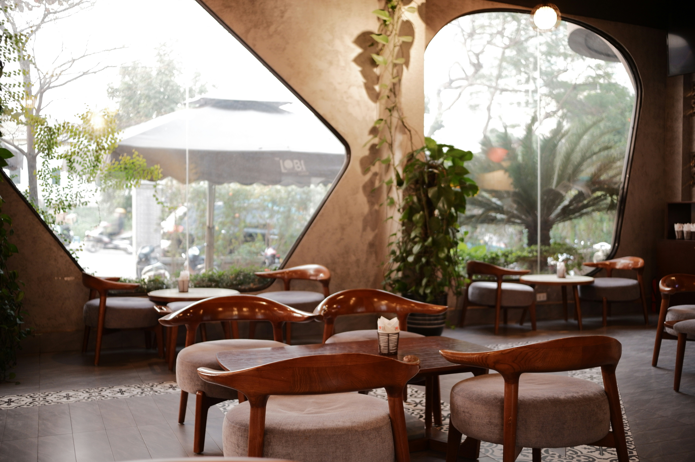

# ☕ Café Nómada

> Landing page de una cafetería de especialidad — diseño moderno, responsive y lista para producción.



[](https://boatingboat271.github.io/cafeterianomada/)
[](https://developer.mozilla.org/es/docs/Web/HTML)
[](https://getbootstrap.com/)
[](https://developer.mozilla.org/es/docs/Web/JavaScript)

---

## 🌐 Demo

**[→ Ver sitio en vivo](https://boatingboat271.github.io/cafeterianomada/)**

---

## ✨ Características

- **One-page responsive** — adaptada a móvil, tablet y escritorio
- **Navbar sticky** con menu colapsable y enlace de reserva destacado
- **Hero section** con llamada a la acción y overlay de imagen
- **Carta / Menú** en cards con hover animado
- **Galería** en carrusel Bootstrap
- **Pedidos para llevar** con modal de confirmación
- **Reseñas** de clientes
- **Formulario de contacto** con validación JavaScript
- **Mapa embebido** de ubicación
- **Smooth scroll** entre secciones
- **Fuente Inter** + color de marca `#b5723f`

---

## 🛠 Stack Tecnológico

| Tecnología | Uso |
|---|---|
| HTML5 semántico | Estructura y accesibilidad |
| CSS3 + custom properties | Estilos y animaciones |
| Bootstrap 5.3 | Layout, componentes y responsive |
| JavaScript vanilla | Validación y comportamiento |
| Google Fonts (Inter) | Tipografía |

---

## 📁 Estructura del Proyecto

```
cafenomada/
├── index.html
└── assets/
    ├── css/
    │   └── style.css
    ├── js/
    │   └── main.js
    └── img/
```

---

## 🚀 Instalacion y uso local

No requiere `npm install` ni proceso de build.

```bash
# 1) Clonar el repositorio
git clone https://github.com/BoatingBoat271/cafeterianomada.git

# 2) Entrar al proyecto
cd cafeterianomada
```

Opciones para ejecutarlo:

```bash
# Opcion A: abrir index.html directamente
# Opcion B: levantar servidor local (recomendado)
npx --yes serve . -l 5500
```

Luego abre `http://localhost:5500`.

---

## 📋 Secciones

1. **Hero** — Bienvenida con imagen de fondo y CTAs
2. **Nosotros** — Historia y propuesta de valor
3. **Carta** — Productos en cards interactivas
4. **Galería** — Carrusel de imágenes del local
5. **Para llevar** — Opción de pedido con modal
6. **Reseñas** — Testimonios de clientes
7. **Contacto** — Formulario validado
8. **Ubicación** — Mapa embebido

---

## 👤 Autor

**Pablo Marelly** — [pablomarelly.cl](https://pablomarelly.cl/)

---

## 📝 Changelog

| Fecha | Cambio |
|---|---|
| 05-02-2026 | Fuente Inter, color de marca `#b5723f`, hover en cards |
