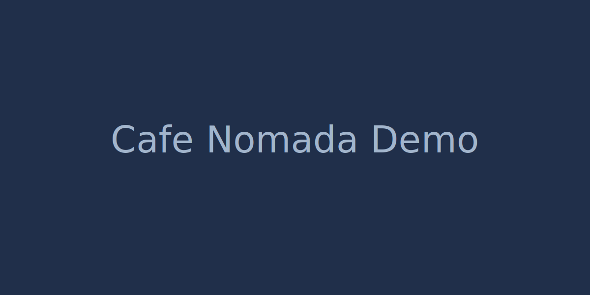

# Cafe Nomada



> Landing page para una cafeteria de especialidad, pensada para comunicar marca, ambientacion, menu y canales de contacto en una sola experiencia visual.

---

## Demo en vivo

[Ver demo en vivo](https://boatingboat271.github.io/cafeterianomada/)

## Repositorio

[Ver codigo en GitHub](https://github.com/BoatingBoat271/Cafeterianomada.git)

---

## Descripcion

Cafe Nomada es un sitio one page orientado a presentar una cafeteria con identidad visual clara, contenido comercial y una navegacion simple. El proyecto combina una portada con imagen de impacto, secciones informativas, menu destacado, galeria, pedidos para llevar, resenas, formulario de contacto y mapa de ubicacion.

Fue desarrollado para demostrar maquetacion semantica, uso de Bootstrap, interaccion con JavaScript y una presentacion cuidada enfocada en experiencia de usuario.

---

## Funcionalidades principales

- Hero con llamada a la accion y botones visibles de navegacion.
- Navbar responsive con acceso rapido a cada seccion.
- Seccion Nosotros con propuesta de valor del local.
- Menu destacado en formato cards.
- Galeria con carrusel Bootstrap.
- Seccion Para llevar con modal de confirmacion.
- Resenas para reforzar confianza y prueba social.
- Formulario de contacto con validacion en JavaScript.
- Ubicacion integrada para facilitar la visita al local.
- Diseno responsive para movil, tablet y escritorio.

---

## Tecnologias utilizadas

| Tecnologia | Uso principal |
|------------|---------------|
| HTML5 | Estructura semantica del sitio |
| CSS3 | Estilos personalizados, layout y detalles visuales |
| Bootstrap 5 | Componentes, grid responsive y carrusel |
| JavaScript | Validaciones y comportamiento interactivo |
| Google Fonts | Tipografia del proyecto |

---

## Estructura del proyecto

```text
Cafenomada/
├── index.html
├── README.md
└── assets/
    ├── css/
    │   └── style.css
    ├── js/
    │   └── main.js
    └── img/
        ├── hero-cafe-nomada.jpg
        ├── logo-cafe-nomada.png
        └── ...
```

---

## Instalacion y uso

Este proyecto no requiere dependencias ni proceso de build.

### Opcion 1: abrir directamente

```bash
git clone https://github.com/BoatingBoat271/Cafeterianomada.git
cd Cafenomada
```

Luego abre index.html en tu navegador.

### Opcion 2: usar Live Server en VS Code

1. Abre la carpeta del proyecto.
2. Haz clic derecho sobre index.html.
3. Selecciona Open with Live Server.

---

## Lo que demuestra este proyecto

- Capacidad para construir una landing page completa y coherente.
- Criterio visual para presentar una marca de forma atractiva.
- Manejo de componentes responsive con Bootstrap.
- Uso de JavaScript para mejorar la experiencia de usuario.
- Estructuracion clara de contenido comercial y de contacto.

---

## Autor

Pablo Marelly

- GitHub: https://github.com/boatingboat271
- LinkedIn: https://www.linkedin.com/in/pablomarelly/
- Web: https://pablomarelly.cl